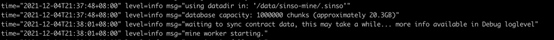

## (Testing phase, functions not fully open)

Currently supported system: Ubuntu 18.04

To install the binary file using our quick installer, please run any of the following commands in the terminal:

## Wget

```html preview
wget https://github.com/sinsoio/mine_publish/archive/refs/tags/v1.0.2.tar.gz
```

- Uncompress:

```html preview
tar -xf v1.0.2.tar.gz
```

- Add the permissions to run executable files:

```html preview
cd mine_publish-1.0.2/ && chmod 755 sinso
```

<!--  -->

## Run SINSO

After installing SINSO, you can test whether it has been successfully installed by starting the node.

```html preview
./sinso start --swap-endpoint=https://data-seed-prebsc-1-s1.binance.org:8545
```

After successfully starting the node, the program will prompt "Welcome to Sinso"


1.  In "Password": Enter the node password (Please memorize the password, it will be needed in subsequent node restarts).

2.  In "Privatekey": Please enter the private key corresponding to the node address.


After the above steps are successfully completed, wait to connect to other nodes, and the following similar prompt appears, indicating that the connection is successful.


## WARNING

When you run SINSO for the first time, the system will ask you to import a wallet address, which is the address of the VIP node you applied for. Besides, you need to import the private key of the address. Please rest assured. because SINSO is a decentralized network, there will be no centralized processing to steal your private key. Importing the private key is for the staking. Since the test staking currency is free to receive, so the staking operation does not require manual operation.

## Staking Reward

SWAP-Endpoint is the RPC interface address of the BSC test chain. Please configure this address by yourself. The official address may be unstable.

SINSO will call the proof-of-work contract each hour to check whether you are online and whether the node has staked coins. If both are satisfied, you will be rewarded with the corresponding workload.

## Join SINSO

If all goes well, you will see your node automatically start connecting to other SINSO nodes around the world

The node officially starts to work.



Now your node will start requesting data blocks that fall within your scope of responsibility-then you will provide data to other p2p clients running in SINSO. Next, your node will start responding to requests from other peers for these blocks, and you will soon be rewarded in SINSO.

## Upgrade SINSO

To upgrade the previous version of SINSO installed using the above method, just re-run the above installation commands.
